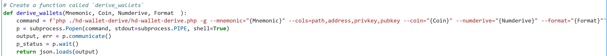
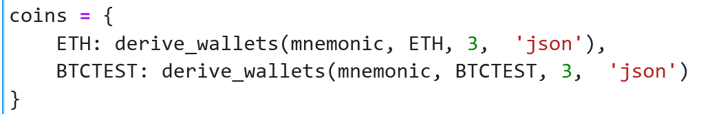
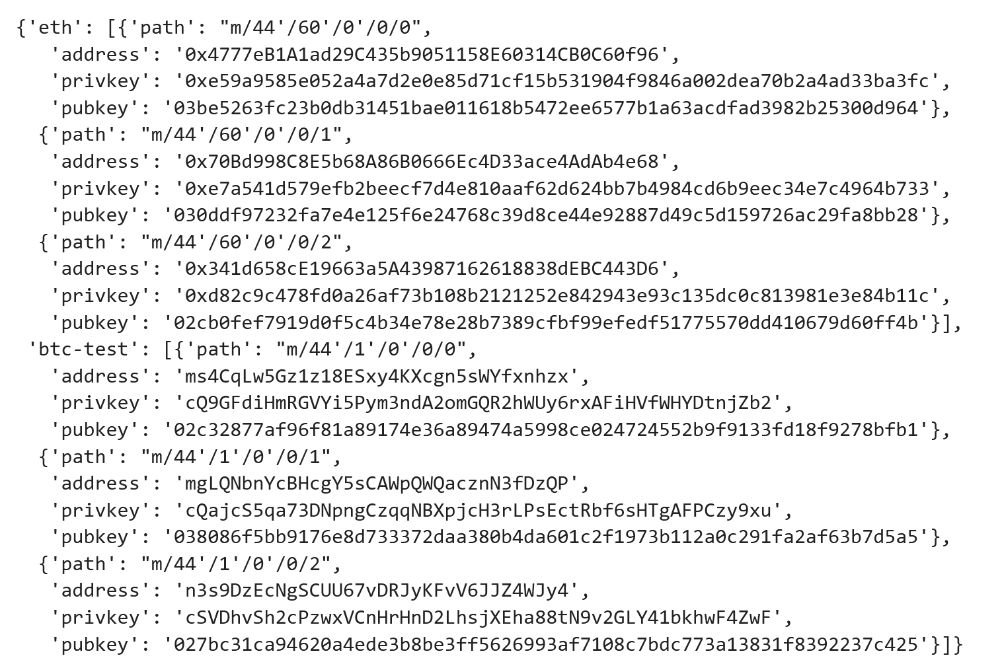
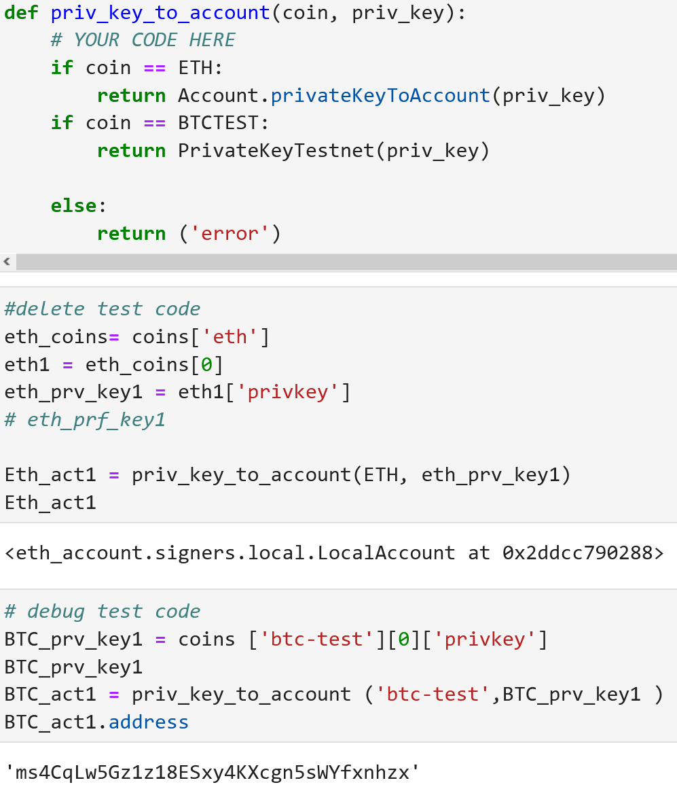
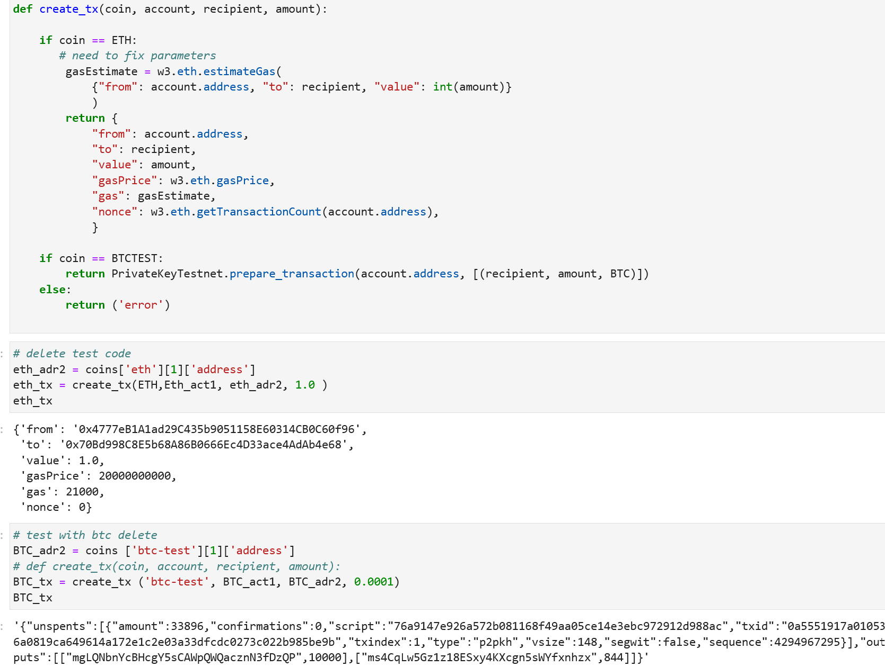
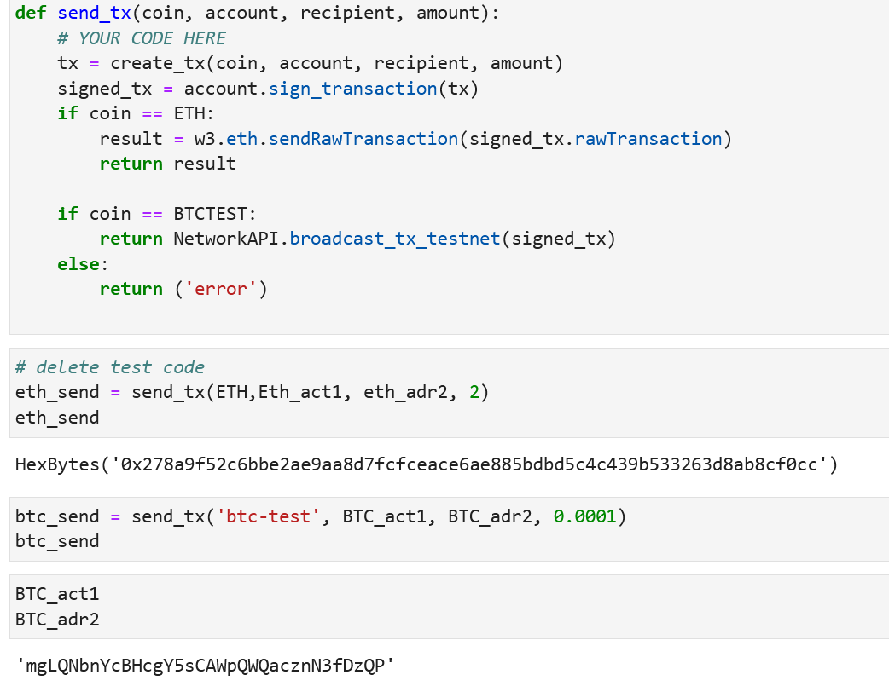
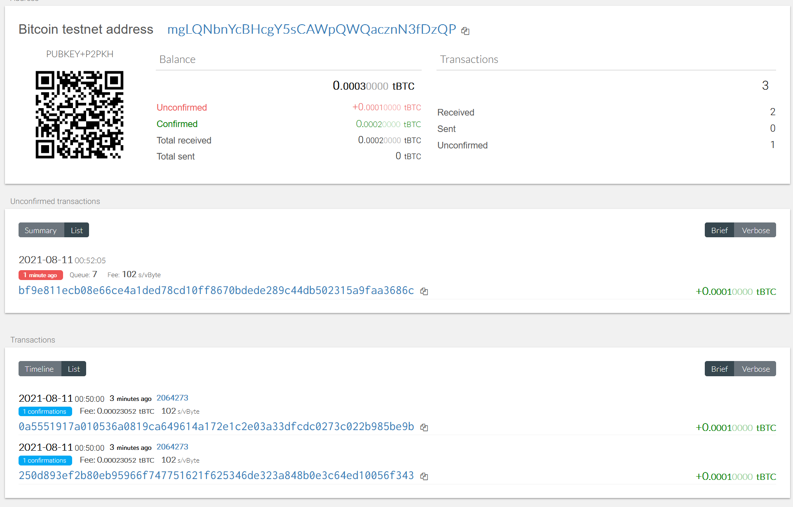
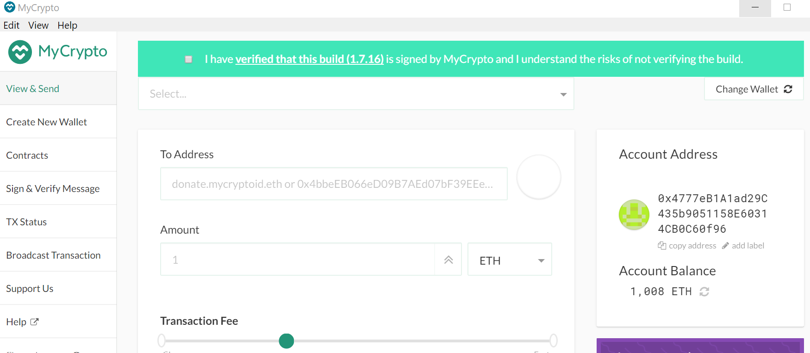
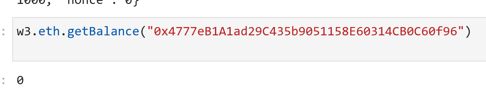
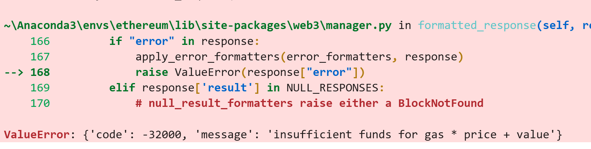

# Homework 19 Block Chain programs with Python
This is homework 19 for creating blockcahai wallet and sending Ethereum and Bitcon Testnet from one address to antoher. 

The main code file is the **wallet** folder: [python_blockchain.ipynb](./wallet/python_blockchain.ipynb)

Below are the appropriate code segments

## Function to derive wallets

## Create coins
 

## Convert Private Key to Account

## Create TX

## Send TX

## Send funds on BTC Testnet

## Send funds on Ethereum POA 
With the Ethereum POA, I was able to set up the Ethereum Network and transfer money in to one of the Ethereum wallets:

I created the wallets with the coins as seen above but the wallet was empty, probably because the bug mentioned in the homework "Due to a bug in web3.py, you will need to send a transaction or two with MyCrypto first, since the w3.eth.generateGasPrice()"

This resulted in a value error

Johnny's suggestion was to submit and ask for forgiveness based on the large amount of effort I put in and none of the TAs could solve the problem.
